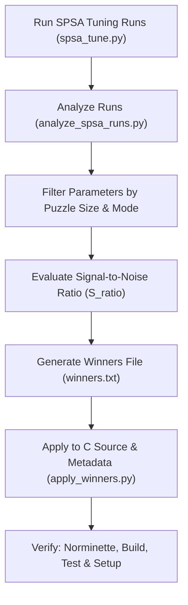

# SPSA Analysis & Winner Application Guide

This skill provides a standardized, context-efficient workflow for analyzing SPSA parameter tuning runs, evaluating signal-to-noise ratios across multi-run data, and applying parameter winners cleanly to the C solver source code and SPSA tuning metadata.

---

## 1. Core Workflow



---

## 2. Parameter Analysis Procedure

Run the automated analysis script on completed SPSA run files:

```bash
# Analyze all run files in scratch/
python3 python_scripts/analyze_spsa_runs.py

# Analyze specific run files for Size 8
python3 python_scripts/analyze_spsa_runs.py --size 8 scratch/run_00.txt scratch/run_01.txt scratch/run_02.txt
```

### Critical Nuances for Analysis:

1. **Size-Aware Parameter Filtering**:
   - When evaluating Size 7 runs, only inspect parameters ending in `_S7` or general size-independent parameters. Ignore `_S8` and `_S9` parameters.
2. **Statistical Noise Floor Estimation**:
   - **Cross-Run Standard Deviation ($\sigma$)**: Measures parameter spread across runs initialized from baseline seeds.
   - **Signal-to-Spread Ratio ($S_{\text{ratio}}$)**:
     $$S_{\text{ratio}} = \frac{|\text{Median} - \text{Default}|}{\sigma}$$
     * **$S_{\text{ratio}} \ge 2.0$**: **Strong Physical Signal** (Consistent directional gradient driving parameters out of baseline seed).
     * **$1.0 \le S_{\text{ratio}} < 2.0$**: **Moderate Signal** (Observable optimization trend).
     * **$S_{\text{ratio}} < 1.0$**: **Flat Loss Region / Noise** (Parameter wandering due to benchmark timing variance; baseline seed is near-optimal or gradient is zero).

---

## 3. Creating & Applying Winners

### Step 1: Create Winner Definitions File
Format winner parameter definitions into a `#define` or `KEY = VAL` formatted text file (e.g. `scratch/math_winners.txt` or `scratch/strategy_winners_s8.txt`).

Example `#define` format:
```c
/* STRATEGY PARAMETERS WINNERS (SIZE 8) */
#define ROOT_PERIOD_COEF_SCALE 50.0
#define SHALLOW_MIN_ENTROPY 223035
#define SHALLOW_LOOKAHEAD_CONSTR_GLOBAL_MIN_ENTROPY 547237
```

### Step 2: Apply Winners using `apply_winners.py`
Use the workspace application script to update C source files (`src/params_math.c`, `src/params_int.c`, `src/params_double.c`) and tuning metadata (`python_scripts/param_metadata.py`):

```bash
python3 python_scripts/apply_winners.py scratch/strategy_winners_s8.txt
```

---

## 4. Mandatory Verification Pipeline

After applying parameter updates, execute the 4-step verification sequence:

```bash
# 1. Check Norminette compliance (Must be 100% OK)
norminette src/

# 2. Build binaries with LTO optimization
make re

# 3. Verify 100% solution count consistency on test sets
micromamba run -n solver make test

# 4. Verify tunable environment setup script
micromamba run -n solver bash setup_and_tune.sh
```
