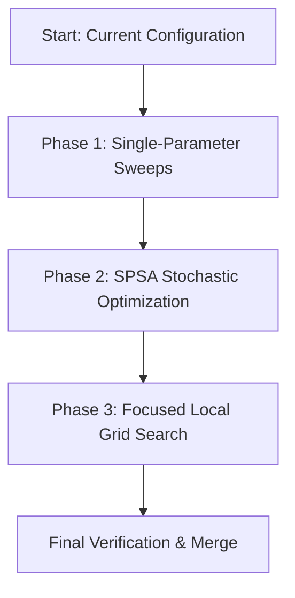

# AGENT_PLAN_HPO: Hyperparameter Optimization Plan

This document outlines a concrete, stochastic, and reiterative methodology for tuning the newly structured pruning constants in the Skyscraper Solver.

---

## 🎯 Optimization Scope & Parameters

With the refactoring completed, all pruning strategy coefficients are located at the top of the respective depth modules (`src/prune_strat_*.c`) as static globals:
* **GAC Thresholds** (`g_gac_unset_threshold`): Controls the unset ratio below which GAC runs.
* **Constraint Ranges** (`g_constr_min_unset`, `g_constr_max_unset`): Boundaries for constraint checks.
* **Period Coefficients** (`g_period_base`, `g_period_coef1`, `g_period_coef2`): Defines the frequency scaling of lookahead evaluations at different depths.

The goal is to optimize these parameters to minimize **Wall Time** and **Node Count**, using **Shifted Geometric Mean (SGM)** as the primary scoring metric.

---

## 🔍 Step 1: Calibration of Size 9 Benchmark Set

A major issue with previous HPO runs was that the benchmark instances were too easy (biasing the solver toward light pruning configurations) or too hard (causing massive timeouts). We need to build a curated, calibrated Size 9 dataset.

### Procedure for Calibrating Size 9:
1. **Load a Large Dataset**: Use a candidate pool of 500–1000 Size 9 instances.
2. **Multi-Solver Run**: Solve the pool using four different solver versions:
   * `dev` binary
   * `main` binary
   * `v08` binary
   * `current` refactored binary
3. **Filter Puzzles**:
   * **Exclude Trivial**: Puzzles solved in $< 0.05$ seconds by any of the versions.
   * **Exclude Pathological / Timeouts**: Puzzles that timeout (e.g., $> 5.0$ seconds) or take excessively long on any of the versions.
   * **Retain Calibration Set**: Keep puzzles that take between $0.1$ and $2.0$ seconds across all four versions. This ensures they are in the "critical zone" of difficulty for all heuristics, avoiding optimization bias towards a single version.
4. **Include Rotations**: For each selected calibration puzzle, generate and include all of its rotated versions (90, 180, and 270 degrees) to control for difficulty variations and reduce single-solution search variance.
5. **Output**: Save the resulting list to `benchmark_sets/benchmarkSet9_calibrated.txt`.

---

## 🛠️ Step 2: Tuning Methodologies

Rather than doing a single massive grid search, the next agent should utilize a hybrid, step-by-step approach.



### 1. Single-Parameter Sweeps
* **Purpose**: Perform sensitivity analysis on individual variables.
* **Mechanism**: Select one parameter (e.g., `g_gac_unset_threshold` in `prune_strat_deep.c`) and sweep it across its range while keeping all other variables at baseline values.
* **Benefit**: Rapidly identifies bounds and reveals if a parameter has a monotonic relation to speed.

### 2. SPSA (Simultaneous Perturbation Stochastic Approximation)
* **Purpose**: Optimize all parameters simultaneously in a high-dimensional space.
* **Mechanism**:
  * In each iteration, perturb all parameters randomly by a small step $c_k$ in directions $\pm 1$ (vector $\Delta_k$).
  * Run the solver on a small stochastically selected subset of puzzles for both perturbed configurations: $e(\theta + c_k \Delta_k)$ and $e(\theta - c_k \Delta_k)$.
  * Estimate the gradient and update the parameter vector $\theta$ by a step size $a_k$.
* **Benefit**: SPSA requires only 2 evaluations per iteration regardless of parameter count, making it extremely fast.

### 3. Focused Local Grid Search
* **Purpose**: Clean up and sweep the immediate neighborhood around the local optimum discovered by SPSA.
* **Mechanism**: Run a small grid search (e.g., 3x3 or 3x3x3) on the top 2-3 variables.

---

## 🎲 Step 3: Variance Control & Anti-Overfitting

To ensure parameters generalize well to unseen puzzles:
1. **Instance Redrawing (Stochastic Subsampling)**:
   * During SPSA/Sweeps, do not run on the entire benchmark set every iteration.
   * Instead, randomly sample a small subset (e.g., 30 instances from Size 7, 20 from Size 8, and 10 from Size 9) at each iteration.
   * Redraw the subset at every iteration/step to prevent the parameters from overfitting to a static list.
2. **Rotations to Reduce Variance**:
   * For the single solution search subsets, always include all 4 rotated versions (0, 90, 180, and 270 degrees) of each sampled instance. This controls for difficulty variance based on puzzle orientation.
3. **Metrics (Shifted Geometric Mean)**:
   * Use SGM to reduce the influence of outlier instances:
     * $\text{SGM}_{\text{time}} = \exp\left(\frac{1}{N}\sum \ln(t_i + 0.1)\right) - 0.1$
     * $\text{SGM}_{\text{nodes}} = \exp\left(\frac{1}{N}\sum \ln(n_i + 1000.0)\right) - 1000.0$
4. **Timeouts**:
   * Implement a strict timeout (e.g., 2.0s per puzzle). If a configuration times out, assign it a high-penalty score (e.g., 5.0s and $100,000$ nodes) rather than letting the script hang.

---

## 🗓️ HPO Implementation Roadmap for the Next Agent

```markdown
- [ ] Phase 1: Environment Support for Static Globals
  - [ ] Modify Makefile to allow building with a flag (e.g. `G_PRUNE_NO_ENV=0`) or pass variables via ENV inside the strategy files.
- [ ] Phase 2: Size 9 Dataset Calibration
  - [ ] Write a script `scratch/calibrate_s9.py` to filter Size 9 puzzles into a medium-hard dataset.
- [ ] Phase 3: Single Parameter Sweeps
  - [ ] Write `scratch/param_sweep.py` to sweep single variables (e.g., GAC thresholds and constraint ratios).
  - [ ] Identify optimal ranges for each parameter.
- [ ] Phase 4: SPSA Optimizer
  - [ ] Write `scratch/spsa_tune.py` implementing SPSA with random instance subsampling and SGM scoring.
  - [ ] Run SPSA for ~100–200 iterations.
- [ ] Phase 5: Neighborhood Fine-Tuning
  - [ ] Run a small grid sweep around the SPSA winner to verify the optimum.
- [ ] Phase 6: Verification & Integration
  - [ ] Clean compile the solver with the new constants.
  - [ ] Verify 100% solution matching via `verify_consistency.py`.
```

---

## 📝 Prompt for the Next Agent

Here is the prompt to copy and paste to launch the next tuning task:

```text
Please implement the Hyperparameter Optimization (HPO) plan described in AGENT_PLAN_HPO.md. 

Do this step-by-step:
1. Enable environment/compilation flag overrides in the strategy files so the tuning python scripts can evaluate parameter candidates.
2. Write a script to calibrate a Size 9 "medium-hard" puzzle set by running dev, main, v08, and current solver binaries, filtering out instances that are trivial (<0.05s) or timeout/take excessively long (>5.0s) on any version.
3. For each selected calibration puzzle, generate and include all of its rotated versions (90, 180, and 270 degrees) in the benchmark set to reduce variance.
4. Write a parameter sweep and SPSA tuning script that uses stochastic instance redrawing (subsampling both standard and rotated variants) and SGM scoring to find optimal values for g_gac_unset_threshold, g_constr_min_unset, g_constr_max_unset, and g_period_base/coef at different depths.
5. Run the HPO, analyze the outputs, and refine parameter bounds iteratively.
6. Update the static constants in the source files and verify correctness with verify_consistency.py.
```
